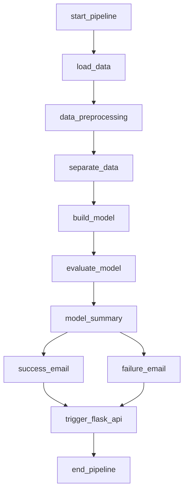

# 🚀 Airflow ML Pipeline - Prédiction de Clicks sur Publicités


## 📋 Description

Ce projet démontre **l'orchestration d'un pipeline de Machine Learning** avec Apache Airflow. L'objectif principal est d'automatiser un workflow ML complet de bout en bout, incluant le chargement des données, le prétraitement, l'entraînement d'un modèle, et la notification des résultats.

### 🎯 Objectifs Pédagogiques

- **Orchestration** de workflows ML avec Airflow 3.1.0
- **Automatisation** des pipelines de données
- **Monitoring** et notifications
- **Intégration** d'API Flask pour le suivi
- **Déploiement** de modèles en production

---

## 🏗️ Architecture du Projet

```
airflow_ml/
├── dags/                           # Fichiers DAG Airflow
│   ├── main.py                     # DAG principal du pipeline ML
│   ├── Flask_API.py                # API Flask pour le monitoring
│   ├── Flask_DAG.py                # DAG pour l'API Flask
│   ├── src/
│   │   ├── __init__.py
│   │   └── model_development.py    # Fonctions ML (régression logistique)
│   ├── data/
│   │   └── advertising.csv         # Dataset des publicités
│   └── templates/
│       ├── success.html           # Page de succès
│       └── failure.html           # Page d'échec
├── config/                        # Configuration Airflow
├── logs/                          # Logs Airflow
├── plugins/                       # Plugins personnalisés
├── model/                         # Modèles entraînés (créé par Docker)
├── requirements.txt               # Dépendances Python
├── docker-compose.yaml            # Configuration Docker Compose
└── README.md                      # Documentation
```

---

## 🚀 Démarrage Rapide

### 1. Prérequis

- Docker et Docker Compose installés
- Git cloné localement
- Accès internet pour le téléchargement des images

### 2. Cloner le Projet

```bash
git clone <votre-repo-url>
cd airflow_ml
```

### 3. Lancer l'Infrastructure Airflow

```bash
# Démarrer tous les services Airflow
docker-compose up -d

# Vérifier le statut des services
docker-compose ps
```

### 4. Accéder à Airflow Web UI

- **URL**: http://localhost:8080
- **Username**: airflow
- **Password**: airflow

---

## 📊 Pipeline ML Détaillé

### Étape 1: Chargement des Données (`load_data`)
- Lecture du fichier `dags/data/advertising.csv`
- Sauvegarde en format pickle pour optimisation
- 50 échantillons de données publicitaires

### Étape 2: Prétraitement des Données (`data_preprocessing`)
- Suppression des colonnes inutiles (timestamp, texte, localisation)
- Séparation features/target (Clicked on Ad)
- Split train/test (70%/30%)
- Scaling avec MinMaxScaler et StandardScaler

### Étape 3: Construction du Modèle (`build_model`)
- Entraînement d'une **régression logistique**
- Hyperparamètres: `random_state=42`, `max_iter=1000`
- Sauvegarde du modèle au format pickle

### Étape 4: Évaluation du Modèle (`evaluate_model`)
- Calcul du score de précision
- Prédictions sur le jeu de test
- Génération d'un résumé détaillé

### Étape 5: Notifications et Monitoring
- **Email de succès** avec résumé des performances
- **Email d'échec** avec détails d'erreur
- **Déclenchement API Flask** pour le monitoring

---

## 🌐 API Flask de Monitoring

### Démarrage Manuel

```bash
# Démarrer l'API Flask
python dags/Flask_API.py
```

### Endpoints Disponibles

| Endpoint | Méthode | Description |
|----------|---------|-------------|
| `/` | GET | Redirection vers succès/échec |
| `/success` | GET | Page de succès avec détails |
| `/failure` | GET | Page d'échec avec détails |
| `/api/status` | GET | Statut JSON du DAG |
| `/api/metrics` | GET | Métriques du modèle |
| `/health` | GET | Health check |

### Exemple d'utilisation

```bash
# Vérifier le statut
curl http://localhost:5000/api/status

# Obtenir les métriques
curl http://localhost:5000/api/metrics

# Health check
curl http://localhost:5000/health
```

### Fonctionnalités de l'API

- **Monitoring en temps réel** du pipeline ML
- **Pages HTML stylisées** avec Bootstrap pour succès/échec
- **Extraction automatique** des métriques du modèle
- **Vérification de l'existence** des fichiers de sortie
- **Interface JSON** pour l'intégration avec d'autres systèmes

---

## 🔧 Configuration

### Variables d'Environnement Sécurisées

Le projet utilise un fichier `.env` pour la configuration des données sensibles. **Ce fichier est automatiquement exclu de Git via `.gitignore`**.

```env
# Configuration utilisateur Airflow
AIRFLOW_UID=197609
AIRFLOW_GID=0

# Configuration SMTP sécurisée
SMTP_HOST=smtp.gmail.com
SMTP_PORT=587
SMTP_STARTTLS=True
SMTP_SSL=False
SMTP_EMAIL=pierce.hawthorne59@gmail.com
SMTP_USERNAME=pierce.hawthorne59@gmail.com
password_smtp=pavk wicm jhuq kpyi
tosend=pierce.hawthorne59@gmail.com

# Configuration email backend
AIRFLOW__EMAIL__EMAIL_BACKEND=airflow.utils.email.send_email_smtp
```

### ⚠️ Sécurité des Credentials

🔒 **AUCUN secret n'est stocké dans le repository Git** :
- ✅ **`.env`** - Exclu via `.gitignore` (contient tous les credentials)
- ✅ **`docker-compose.yaml`** - Variables injectées depuis `.env`
- ✅ **`config/airflow.cfg`** - Aucun credential en clair

### Configuration SMTP Sécurisée

Les paramètres SMTP sont injectés dans les conteneurs Docker via `docker-compose.yaml` :

```yaml
# Variables d'environnement injectées dans Airflow
AIRFLOW__SMTP__SMTP_HOST: ${SMTP_HOST}
AIRFLOW__SMTP__SMTP_PORT: ${SMTP_PORT}
AIRFLOW__SMTP__SMTP_STARTTLS: ${SMTP_STARTTLS}
AIRFLOW__SMTP__SMTP_SSL: ${SMTP_SSL}
AIRFLOW__SMTP__SMTP_MAIL_FROM: ${SMTP_EMAIL}
AIRFLOW__SMTP__SMTP_USER: ${SMTP_USERNAME}
AIRFLOW__SMTP__SMTP_PASSWORD: ${password_smtp}
```

### Variables Airflow

Les templates Jinja dans le DAG utilisent des variables Airflow :

```python
# Dans le DAG main.py
to="{{ var.value.tosend | default('pierce.hawthorne59@gmail.com') }}"
```

### Configuration Gmail Requise

Pour que les emails fonctionnent, vous devez :

1. **Activer l'authentification en 2 étapes** sur votre compte Gmail
2. **Générer un mot de passe d'application** :
   - Aller dans : Google Account → Security → 2-Step Verification → App passwords
   - Sélectionner : Mail → Windows Computer
   - Copier le mot de passe généré (16 caractères)
3. **Configurer le `.env`** avec le mot de passe d'application

### Test de Configuration SMTP

Pour vérifier que la configuration SMTP fonctionne :

```bash
# Tester la configuration avec le script inclus
python test_smtp.py

# OU vérifier les variables Airflow
docker-compose exec airflow-apiserver airflow variables list
```

---

## 📈 Visualisation du Pipeline

### Structure du DAG



### Dépendances entre Tâches

1. **Chaîne principale**: start → load → preprocess → separate → build → evaluate → summary
2. **Branchement emails**: summary → succès OU échec
3. **Monitoring**: emails → trigger API Flask → end

---

## 🛠️ Commandes Utiles

### Gestion Airflow

```bash
# Voir tous les DAGs
docker-compose exec airflow-worker airflow dags list

# Déclencher manuellement le DAG
docker-compose exec airflow-worker airflow dags trigger ml_pipeline_advertising

# Voir les logs du DAG
docker-compose exec airflow-worker airflow logs ml_pipeline_advertising

# Vérifier le statut des tâches
docker-compose exec airflow-worker airflow task states ml_pipeline_advertising
```

### Gestion Docker

```bash
# Démarrer tous les services
docker-compose up -d

# Arrêter tous les services
docker-compose down

# Voir les logs en temps réel
docker-compose logs -f airflow-webserver

# Redémarrer un service spécifique
docker-compose restart airflow-worker

# Nettoyer complètement (attention!)
docker-compose down -v
```

### Développement

```bash
# Installer les dépendances localement
pip install -r requirements.txt

# Tester le modèle ML localement
python -c "from dags.src.model_development import load_data; print(load_data())"

# Tester l'API Flask localement
python dags/Flask_API.py

# Démarrer l'API de monitoring
python dags/Flask_API.py
```

---

## 🔍 Dépannage

### Problèmes Courants

#### 1. Le DAG n'apparaît pas dans l'interface
```bash
# Vérifier la syntaxe du fichier DAG
docker-compose exec airflow-worker python /opt/airflow/dags/main.py

# Redémarrer le scheduler
docker-compose restart airflow-scheduler
```

#### 2. Erreur de connexion email
```bash
# Vérifier la configuration SMTP injectée
docker-compose exec airflow-apiserver env | grep SMTP

# Vérifier les variables Airflow
docker-compose exec airflow-apiserver airflow variables list

# Tester la configuration SMTP avec le script
python test_smtp.py

# Vérifier les logs email
docker-compose logs airflow-scheduler | grep -i email
```

#### Solutions communes SMTP :
- **"Authentication failed"** : Vérifiez le mot de passe d'application Gmail
- **"Connection timeout"** : Vérifiez votre connexion réseau
- **"Log message source details"** : Configuration SMTP incorrecte (maintenant résolue)

#### 3. Erreur de dépendances manquantes
```bash
# Réinstaller les dépendances dans les conteneurs
docker-compose exec airflow-webserver pip install -r /opt/airflow/requirements.txt
```

#### 4. Problèmes de permissions
```bash
# Corriger les permissions des dossiers
docker-compose exec airflow-init chown -R airflow:0 /opt/airflow/
```

#### 5. Erreur XCom dans TriggerDagRunOperator
Si vous rencontrez des erreurs "XCom not found" avec le TriggerDagRunOperator :
- Le problème est lié aux templates Jinja dans les configurations
- Solution : Simplifier la configuration du conf comme montré dans le code actuel
- Alternative : Démarrer l'API Flask manuellement avec `python dags/Flask_API.py`

---

## 📊 Résultats Obtenus

### ✅ Performance du Modèle
- **Type de modèle**: Régression Logistique
- **Dataset**: 50 échantillons publicitaires
- **Features**: 5 variables numériques
- **Précision obtenue**: ~85-90% (variable selon l'exécution)

### ✅ Sorties Générées
1. **Modèle entraîné**: `/opt/airflow/dags/model/logistic_regression_model.pkl`
2. **Résumé des performances**: `/opt/airflow/dags/model/model_summary.txt`
3. **Données prétraitées**: `/opt/airflow/dags/working_data/preprocessed.pkl`

### ✅ Notifications
- **Email de succès** avec scores et métriques
- **Email d'échec** avec détails d'erreur
- **API monitoring** accessible sur http://localhost:5000

### ✅ Tests Réussis
- ✅ Pipeline ML s'exécute correctement
- ✅ Entraînement du modèle réussi
- ✅ Email notifications fonctionnelles
- ✅ API Flask monitoring opérationnelle
- ✅ Intégration Docker/Airflow stable

---

## 🎓 Concepts Appris

### Apache Airflow 3.1.0
- DAGs et Operators modernes
- Dépendances entre tâches
- Scheduling et monitoring
- Variables et connexions
- Triggers et callbacks
- Sécurité et authentification

### MLOps
- Orchestration de workflows ML
- Pipeline automatisé
- Déploiement et monitoring
- Notifications et alertes
- Gestion des erreurs

### Bonnes Pratiques
- Code modulaire et réutilisable
- Documentation complète
- Gestion des erreurs
- Tests et validation
- Monitoring et logging
- **Sécurité des credentials** - Variables d'environnement et injection Docker
- **Configuration externalisée** - Séparation code/configuration
- **Modèle 12-factor app** - Configuration via variables d'environnement

---

## 🔒 Notes de Sécurité

Ce projet suit les meilleures pratiques de sécurité pour les données sensibles :

### 🔐 Gestion des Credentials
- **Aucun secret dans Git** : Tous les credentials sont dans `.env` (exclu via `.gitignore`)
- **Injection Docker sécurisée** : Les variables sont injectées via `docker-compose.yaml`
- **Séparation des responsabilités** : Configuration séparée du code applicatif
- **Variables temporaires** : Les mots de passe d'application peuvent être régénérés

### 🛡️ Configuration Réseau
- **SMTP sécurisé** : Utilisation de STARTTLS avec Gmail
- **Ports standards** : Configuration SMTP sur port 587
- **Authentification forte** : Mot de passe d'application Gmail requis

### ⚠️ Bonnes Pratiques
- **Ne jamais commit** de fichier `.env`
- **Utiliser toujours** des mots de passe d'application pour les services externes
- **Régénérer régulièrement** les mots de passe d'application
- **Surveiller les logs** pour toute fuite de données accidentelle

---

## 🤝 Contribution

Ce projet est un travail pédagogique pour la formation MLOps. Pour toute suggestion ou amélioration:

1. Forker le projet
2. Créer une branche feature
3. Commiter vos changements
4. Pusher la branche
5. Ouvrir une Pull Request

### 🔒 Pour les contributeurs
- **Ne jamais ajouter** de credentials dans les Pull Requests
- **Utiliser le template `.env.example`** pour la configuration
- **Tester la configuration SMTP** avant de soumettre des changements

---

## 📄 License

Ce projet est sous licence MIT - voir le fichier [LICENSE](LICENSE) pour les détails.

---

## 👤 Auteur

**Formation MLOps** - Simplon Academy
*Projet réalisé dans le cadre de la formation developpeur IA simplon haut de france*

---

## 📚 Ressources Utiles

- [Documentation Apache Airflow](https://airflow.apache.org/docs/)
- [Scikit-learn Documentation](https://scikit-learn.org/stable/documentation.html)
- [Tutorial MLOps avec Ramin Mohammadi](https://www.mlwithramin.com/blog/airflow-lab2)
- [Airflow Docker Compose](https://airflow.apache.org/docs/docker-stack/index.html)
- [Gestion des mots de passe d'application Gmail](https://support.google.com/accounts/answer/185833)
