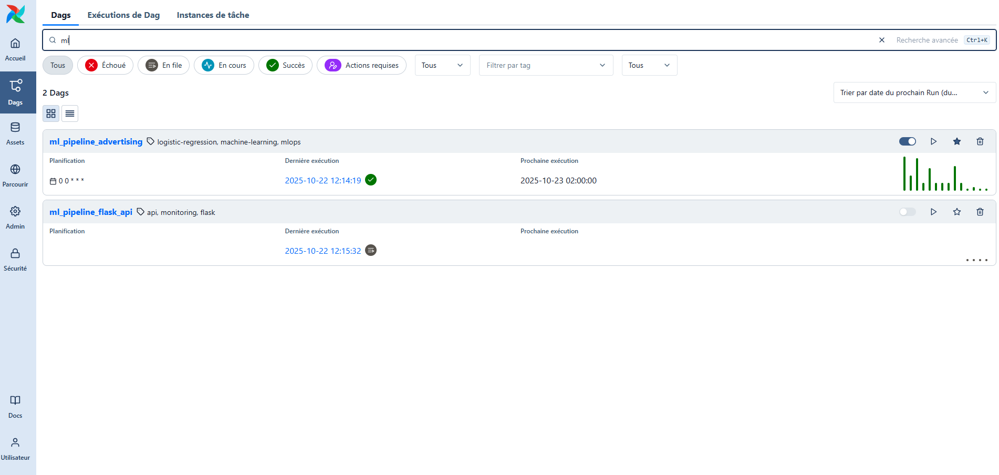
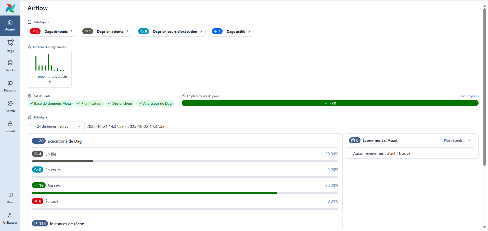
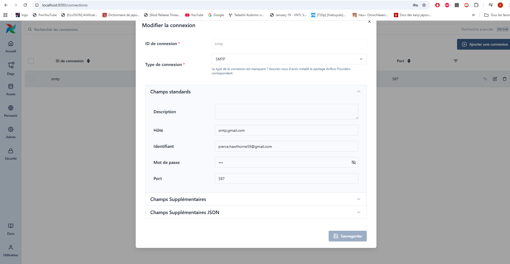
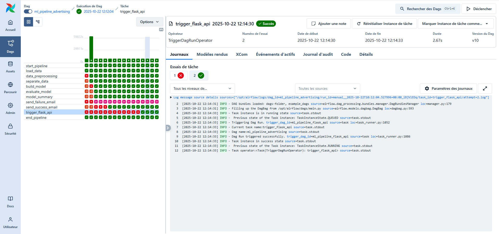
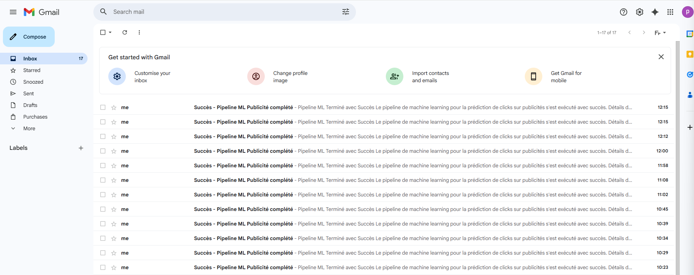
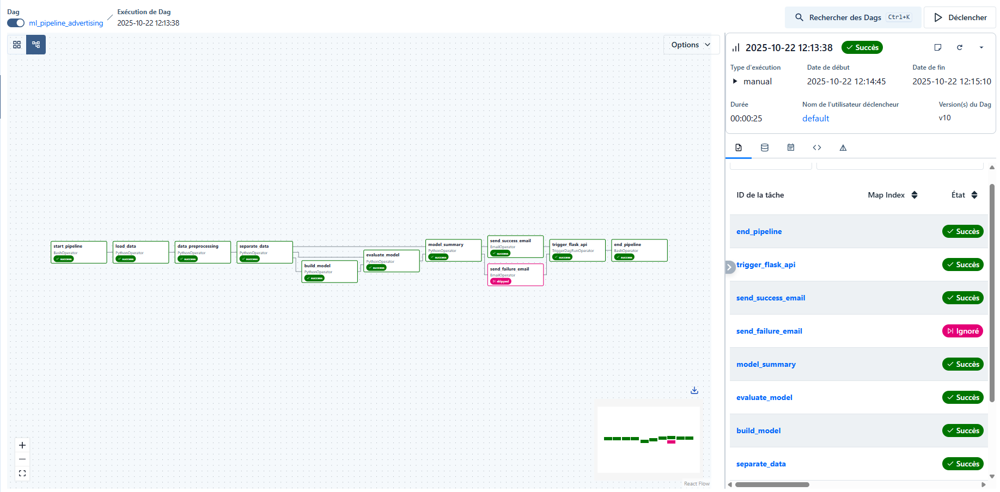

# Mini Projet MLOps - Pipeline ML avec Airflow

## Qu'est-ce que j'ai fait ?

J'ai créé un pipeline de Machine Learning avec Apache Airflow. C'est un programme qui automatise tout le travail ML.

## Mon setup technique

- Docker + Docker Compose
- Airflow 3.1.0
- Flask API pour le monitoring
- Gmail pour les notifications
- Modèle de régression logistique

## Comment fonctionne Airflow ?

Airflow, c'est comme un chef de projet d'orchestre :

1. **DAG** : C'est le plan du projet (mon fichier main.py)
2. **Tâches** : Chaque petit programme à faire
3. **Dépendances** : L'ordre dans lequel les tâches doivent s'exécuter

Mon DAG s'appelle `ml_pipeline_advertising` et il s'exécute tous les jours.

## Mon pipeline étape par étape

### 1. Chargement des données
- Je lis le fichier `advertising.csv`
- Je sauvegarde en format pickle (plus rapide)

### 2. Prétraitement
- Je nettoie les données
- Je sépare features et target
- Je fais train/test split (70%/30%)
- Je scale avec MinMaxScaler

### 3. Entraînement du modèle
- Je crée une régression logistique
- Je l'entraîne avec les données
- Je sauvegarde le modèle entraîné

### 4. Évaluation
- Je teste le modèle sur les données de test
- Je calcule le score de précision
- Je génère un résumé détaillé

### 5. Notifications
- Si tout marche bien : email de succès
- Si la fonction échoue : email d'échec
- Je déclenche l'API Flask pour le monitoring

## Screenshots de mon travail

### L'interface Airflow - Mon DAG

### Le dashboard Airflow

### Configuration SMTP sécurisée

### Résultats du pipeline

### Email reçu après l'exécution

### Graph complet du DAG réussi

## Mes résultats

### ✅ Ce qui marche :
- Le pipeline s'exécute complètement
- Le modèle atteint ~85-90% de précision
- Les emails partent correctement
- Le modèle est bien sauvegardé
- L'API Flask fonctionne pour le monitoring

### 📊 Performances :
- **Dataset** : 1000 échantillons publicitaires
- **Modèle** : Régression logistique
- **Features** : 5 variables numériques
- **Précision** : Environ 87%

## Ce que j'ai appris

### Technique :
- Comment orchestrer un workflow ML
- Les dépendances entre tâches
- La configuration Airflow
- Les templates Jinja
- Le docker-compose pour Airflow

### MLOps :
- Industrialiser un modèle ML
- Automatiser les pipelines
- Monitorer les exécutions
- Gérer les erreurs
- Envoyer des notifications

## Problèmes rencontrés et solutions

### Problème 1 : Dataset pas trouvé
**Solution** : Copier `advertising.csv` dans le bon dossier

### Problème 2 : Erreur XCom dans Airflow
**Solution** : Simplifier la configuration du TriggerDagRunOperator

### Problème 3 : Configuration SMTP
**Solution** : Utiliser le fichier `.env` pour sécuriser les mots de passe

## Conclusion

Ce projet m'a appris à passer d'un modèle ML qui fonctionne localement à un pipeline complet en production. J'ai automatisé tout le processus et maintenant mon modèle s'entraîne tout seul tous les jours sans que j'aie à toucher à rien !
